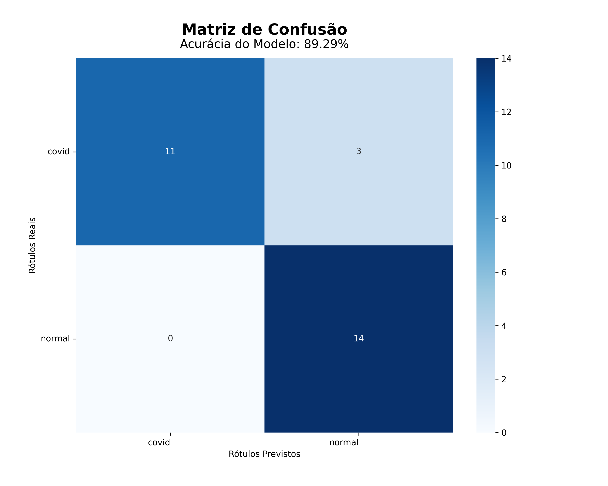

- [CNN para classificaçao de imagens médicas de diagnosticos de Covid-19](#cnn-para-classificaçao-de-imagens-médicas-de-diagnosticos-de-covid-19)
- [Autor](#autor)
- [Descritor](#descritor)
- [Repositório](#repositório)
- [Classificador e acurácia](#classificador-e-acurácia)
  - [Resultados](#resultados)
- [Instruções](#instruções)

# CNN para classificaçao de imagens médicas de diagnosticos de Covid-19

Este trabalho foi feito para a matéria de processamento de imagens da UTPFR-CP no primeiro semestre de 2025 no curso de engenharia de computação.

# Autor

João Pedro Silva Cassimiro 
2142600 
[https://github.com/JPCassimiro](https://github.com/JPCassimiro) 

# Descritor

Metodologia: Transfer-learning 
Modelo base: Xception 
Camadas adicionadas de descrição: BatchNormalization, GlobalAveragePooling2D 

Dataset: COVID-19 & Normal Posteroanterior(PA) X-rays 
Classes: 2 
Total de imagens: 280 
Sobre: raio-x com duas categorias diferentes, covid ou normal 
link: [https://www.kaggle.com/datasets/tarandeep97/covid19-normal-posteroanteriorpa-xrays](https://www.kaggle.com/datasets/tarandeep97/covid19-normal-posteroanteriorpa-xrays) 

# Repositório

[https://github.com/JPCassimiro/CNN-COVID-19](https://github.com/JPCassimiro/CNN-COVID-19)

# Classificador e acurácia

Estrutura de camadas de classificação:

    x = tf.keras.layers.Dropout(0.5)(x)
    x = tf.keras.layers.Dense(64,kernel_regularizer=tf.keras.regularizers.L2(0.01), activation='relu')(x)
    x = tf.keras.layers.Dropout(0.5)(x)
    output_layer = tf.keras.layers.Dense(1, activation='sigmoid')(x)

Otimizador: Adam (0.0001) 
Função de perda: Binary Crossentropy 
Métrica: Accuracy 

## Resultados

Histórico de treinamento

Matriz de confusão

Precisão

Recall

F1-Score

# Instruções

    Baixe os arquivos deste repositório
    Crie uma pasta no Google Drive e adicione-os na mesma
    Baixe o dataset (link acima)
    Descompacte o dataset na pasta "original_dataset"
    Acesse o arquivo "main.ipynb"
    Altere o valor da variável "folder_path" para o caminho da pasta raiz do projeto no seu Google Drive
    Clique em "Executar tudo"
    Após a primeira execução, comenta a linha "split_folders(original_dataset,dataset_path)" localizada na função "Menu()"